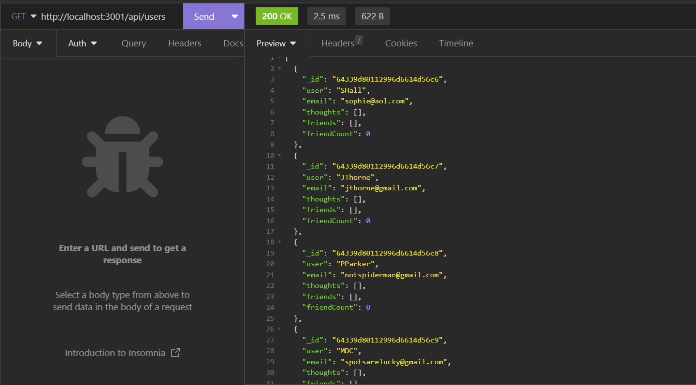

# DU Challenge 18 - Social Network API

## Description

Week 10 DU Bootcamp Challenge.  
 
My task this week was to build an API for a social network web application where users can share their thoughts, react to friends’ thoughts, and create a friend list. I was to use Express, MongoDB, and Mongoose.

## Links

[Video 1](https://drive.google.com/file/d/17n0ulW6dzvJF__rWeAAFklILNJgs9Y0t/view)  
[Video 2](https://drive.google.com/file/d/1RJnvgwawBxnyzKVytqSo8nzHs_2IzmYh/view)

## License

MIT

## Usage

npm i to install  
npm run seed to seed data  
npm start to start server 

 

